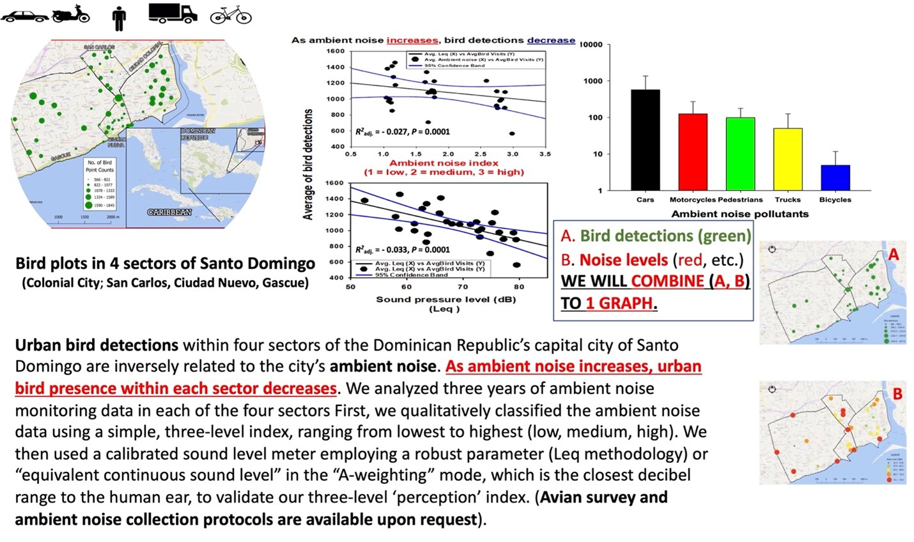

```{r setup, include=FALSE}
library(sf)
library(terra)
library(tidyverse)
library(ggfortify)
library(ggrepel)
library(readxl)
library(kableExtra)
library(flextable)
library(leaflet)
library(htmltools)
library(viridis)
library(DT)
library(iNEXT)
library(unmarked)
library(spOccupancy)

knitr::opts_chunk$set(echo = TRUE)
options(knitr.kable.NA = '')
knitr::opts_current$get('Table')
```


<br>   

# Read in clean bird data  

In addition to reading in the clean bird data, we removed the bird sites that are not paired with i-Tree plots.    

```{r message=FALSE}
birditree_sitejoin_key <- readRDS(file = "../data/iTree_Bird_site_key.RDS")

# save bird key names following corrections
key_bird_names <- readRDS(file = "../data/bird/key_bird_names.RDS")

# load raw point count data
bird_ptct_data_raw <- readRDS(file = "../data/RDS/bird_pointcount_data.RDS")
bird_ptct_data <- filter(bird_ptct_data_raw, !(SiteID %in% c(paste0("ZCA0",1:7), 
                                                             "SC15", "GA999") ) )

# load point count abundance data
bird_abund_71wFO <- 
  readRDS(file = "../data/RDS/bird_abundace_data_71sites_wFO.RDS")
bird_abund_71woFO <- 
  readRDS(file = "../data/RDS/bird_abundace_data_71sites_woFO.RDS")
bird_abund_60wFO <- 
  readRDS(file = "../data/RDS/bird_abundance_data_60itreesites_wFO.RDS")
bird_abund_60woFO <- 
  readRDS(file = "../data/RDS/bird_abundance_data_60itreesites_woFO.RDS")


# load site visit data 
bird_site_data_raw <- readRDS(file = "../data/RDS/bird_sitevisit_data.RDS")
bird_site_data <- filter(bird_site_data_raw, !(SiteID %in% c(paste0("ZCA0",1:7),
                                                             "SC15", "GA999") ) )

# load merged data 
bird_ptctsite_data_raw <- 
  readRDS(file = "../data/RDS/bird_merged_pointcount_and_sitevisit_data.RDS")
bird_ptctsite_data <- 
  filter(bird_ptctsite_data_raw, !(SiteID %in% c(paste0("ZCA0",1:7), 
                                                 "SC15", "GA999") ) )

# spatial data for sites
bird_siteID_sf <- birditree_sitejoin_key |>
  filter(!is.na(PlotNum)) |>
  sf::st_as_sf(coords = c("long", "lat"))
```

<br>  

# Exploring site data  


## Sites by sector

Bird data for the Santo Domingo study area are divided into four sectors. These are the same sectors used by the i-Tree data, but with slightly different naming conventions. We will continue to use a two-letter code to identify each sector throughout the analysis, but will unify them according to the bird data names (i.e., modify the i-Tree data sector names to match the bird data). I've also used the English names for the time being, but can easily make the switch to Spanish if that's more appropriate/preferred.    

```{r}
sites_per_sector_df <- bird_site_data |>
  reframe(.by = c(SectorName, SectorID, SiteID), site_n = n()) |>
  reframe(.by = c(SectorName, SectorID), site_n = n())

sites_per_sector_df |>
  knitr::kable(format = "html", 
             col.names = c("Sector Name","Sector Alpha ID", "Site Total"),
             align = c('l','c', 'c'),
             caption = "Table 1. Sector names, sector two-letter alpha code IDs, and number of sites per sector.") |>
  kableExtra::kable_styling(bootstrap_options = c("hover", "bordered"), 
                            full_width = FALSE, position = "left")
```


## Site Map  

Each sector is has a specified color:  
- Ciudad Nueva: black  
- Gazcue: purple  
- San Carlos: pink  
- Zona Colonial : orange


```{r warning = FALSE}
# Set up basemap tiles for various background maps
basemap <- leaflet() |>
  # add background maps
  addProviderTiles("Esri.WorldTopoMap", group = "Esri.WorldTopoMap") |>
  addProviderTiles("Esri.WorldImagery", group = "Esri.WorldImagery") |>  
  addProviderTiles("OpenStreetMap.Mapnik", group = "OpenStreetMap.Mapnik") |>
  # add a layers control
  addLayersControl(baseGroups = c("Esri.WorldTopoMap",
                                  "Esri.WorldImagery",
                                  "OpenStreetMap.Mapnik"),
  # position background map selection icon in the top-left part of map
  position = "topleft")
```


```{r warning = FALSE, fig.cap="**Figure 1.** Sites representing those that are matched between bird and i-Tree data across four sectors ( Ciudad Nueva: black; Gazcue: purple; San Carlos: pink; Zona Colonial: orange)."}
# create palette for sector markers
sector_cols <- colorFactor(palette = viridis(4, option = "A", end = 0.85), 
                           levels = factor(bird_siteID_sf$SectorName,
                                           levels = c("Ciudad Nueva","Gazcue",
                                                      "San Carlos","Zona Colonial")) )

# Map the plots for each sector.  
(SD_plot_leaflet <- basemap |>
    addCircleMarkers(data = bird_siteID_sf,
                     popup = ~paste0("Sector: ", SectorName, "<br>","Site ID: ", SiteID), 
                     radius = 4, opacity = 1,
                     color = ~ sector_cols(SectorName) ) 
)
```


<br>

## Site visitation history  


To explore patterns of site visitation, a histogram shows at how frequently sites were returned to across the entire study period.  


```{r message = FALSE, fig.cap = "**FIGURE 2.**  Histogram presenting the frequency/count of days a site was visited (throughout the duration of the study) versus the number of sites (among the 69 total) that tallied that visitation frequency."}
site_visit_df <- bird_site_data |>
  reframe(.by = c(SiteID), sitevisits = n())

ggplot(data = site_visit_df) + 
  geom_histogram(aes(x = sitevisits)) + 
  theme_bw() +
  labs(x = "Frequency/count of daily visits to a given site", 
       y = "Number of sites visited at a given frequency/count")
```

<br>  

There are `r {nrow(site_visit_df)}` bird survey sites across the Santo Domingo study area. The site visited the least frequently had was returned to `r {min(site_visit_df$sitevisits)}` times, while the site most frequently visited was returned to `r {max(site_visit_df$sitevisits)}` times. Most sites were visited `r {median(site_visit_df$sitevisits)}` times plus or minus one or two visits. This is not surprising, but good to verify an even visitation rate across the full study period.    

<br>  

Let's look at this same figure, but split by sector.

```{r message = FALSE, fig.cap = "**FIGURE 3.**  Histograms by sector that present the frequency/count of days a site was visited (throughout the duration of the study) versus the number of sites (among the 69 total) that tallied that visitation frequency."}
bird_site_data |>
  reframe(.by = c(SectorName, SiteID), sitevisits = n()) |>
  ggplot(data = _) + 
  geom_histogram(aes(x = sitevisits)) + 
  geom_label(data = sites_per_sector_df, 
            aes(x = 91, y = 9.5, label = paste0(site_n," sites")), 
            hjust = 0) +
  theme_bw() +
  labs(x = "Frequency/count of daily visits to a given site", 
       y = "Number of sites visited at a given frequency/count") +
  facet_wrap(~SectorName)
```

<br>  

Splitting by sector doesn't reveal any other problematic patterns with visitation rates among sectors.    


<br>  

How about through time?

```{r message = FALSE, fig.cap = "**FIGURE 4.**  Density ridge plot showing distribution of site visits (count of days spent at a site) for each year within the study duration."}
site_visit_byyear_df <- bird_site_data |>
  mutate(smpl_yr = lubridate::year(Date)) |>
  reframe(.by = c(smpl_yr, SiteID), sitevisits = n())

ggplot(data = site_visit_byyear_df) + 
  ggridges::geom_density_ridges(aes(x = sitevisits, y = factor(smpl_yr))) + 
  theme_bw() + 
  theme(legend.position = "none") +
  labs(x = "Total count of site visits", 
       y = "Sample year",
       title = "Distributions for the number of times a site was visited each year")
```
 
<br>  

This ridge plot shows that for 2017 through 2022 there are roughly 12-15 daily site visitations per site per year. 2016 and 2023 are somewhat lower, but likely reflect partial years of data (started in Oct 2016 and current data ends in May 2023).  


<br>  
 
## Noise Data  

### Noise types  


```{r}
site_noise_df <- bird_site_data |>
  select(SID, starts_with("NoiseType"), -NoiseTypels) |>
  pivot_longer(cols = !SID, names_to = "Column", values_to = "NoiseType") |>
  mutate(Column = 1, NoiseType = factor(NoiseType) ) |>  
  distinct() |>
  pivot_wider(id_cols = SID, names_from = NoiseType, 
              values_from = Column, values_fill = 0) |>
  select(-starts_with("NA")) %>% 
  select(SID, order(colnames(x=.)))
```


The types of noise are difficult to parse in the unnamed field format read in, so they have been reogranized into a separate data frame that can be joined by SID to note which type of noise was detected at each site for each row in the original site data set. This data frame has `r {ncol(select(site_noise_df, -SID))}` columns representing different noise/sounds recorded at a site, so it is not printed here to view. However, below is a list of the various noise types and how many times they were recorded at a sites within each sector. There are likely some types of noise that could be combined/reclassified into a single group or eliminated as too rare to be useful (I'm looking at you, "deranged man on drugs"), so review this table with an eye for ways to condense these noise types into useful categories.   


```{r}
site_noise_df |> 
  left_join(select(bird_site_data, SID, SectorName), by = "SID") |>
  select(-starts_with("SID")) |> 
  pivot_longer(cols = !SectorName, names_to="NoiseType", values_to="Count") |> 
  reframe(.by = c(SectorName, NoiseType), sectorsum = sum(Count, na.rm = TRUE)) |>
  pivot_wider(id_cols = NoiseType, names_from = SectorName, values_from = sectorsum) |> 
  rowwise() |>
  mutate(Total = sum(`Ciudad Nueva`,`Gazcue`,`San Carlos`,`Zona Colonial`, 
                     na.rm = TRUE) ) |> 
  select(NoiseType, all_of(c("Ciudad Nueva", "Gazcue", "San Carlos", 
         "Zona Colonial")), Total) |>
  DT::datatable(caption = "Table 2. Types of noise and thier total count recorded in surveys by sector.",
                options = list(order = list(list(1,'asc')) ),
                rownames = FALSE, colnames = c('Noise Type' = 'NoiseType'),)
```


Some obvious combinations are those where capitalization or spelling are all that separate different entries (e.g., "Cars" vs "cars" and "motorised street cleaner" vs "motorized street cleaner"). Would additional groupings be useful when reviewing noise type relationships with bird survey data? For example, could grouping cars, trucks, motorcycles, and buses into a "passenger transport vehicle" category be a way to condense some of the various noises?  

<br>  

### Environmental noise index  

We can compare distribution patterns of environmental noise index ratings for sites between sectors.  

```{r}
site_envns_site_stats <- bird_site_data |>
  select(SectorName, SiteID, EnvNoise) |>
  reframe(.by = c(SectorName, SiteID), EnvNs_avg = mean(EnvNoise, na.rm = TRUE)) 

site_envns_pt_stats <- site_envns_site_stats|>
  reframe(.by = SectorName, EnvNs_mean = mean(EnvNs_avg), EnvNs_sd = sd(EnvNs_avg)) |>
  mutate(ymin = EnvNs_mean - EnvNs_sd, ymax = EnvNs_mean + EnvNs_sd)
```


```{r}
# site_envns_site_stats |>
#   arrange(SectorName, SiteID) |>  group_by(SectorName) |>
#   mutate(sitenum = seq_along(SectorName)) |>
#   full_join(select(bird_site_data, SiteID, EnvNoise), by = "SiteID") |>
#   ggplot(data = _, aes(x = sitenum, y = EnvNoise)) + 
#   geom_point() +
#   geom_point(aes(y = EnvNs_avg), color = "red") +
#   labs(x = "Sites", y = "Environmental noise index value (1-3)", 
#        title = "Environmental noise index value at each site by sector",
#        subtitle = "Red dots represent mean count at each site") + 
#   theme(axis.text.x=element_blank(), axis.ticks.x=element_blank()) + theme_bw() +
#   facet_wrap(~ SectorName)
```


```{r fig.cap = "**FIGURE 5.**  Distribution of mean site environmental noise index scores by sector. Violin plots present full distribution of site means and highlight the 0.25, 0.5, and 0.75 quantiles. Points represent the mean index score for a sector plus/minus one standard deviation. Letters indicate statistically significant (one-way ANOVA) difference in means (points) when sectors do not share a letter."}
bird_site_data |>
  select(SectorName, SiteID, EnvNoise) |>
  reframe(.by = c(SectorName, SiteID), EnvNs_avg = mean(EnvNoise, na.rm = TRUE)) |>
  filter(!is.na(EnvNs_avg)) |>
  ggplot(data = _, aes(y = EnvNs_avg, x = SectorName)) +
  # geom_boxplot() +
  geom_violin(draw_quantiles = c(0.25, 0.5, 0.75)) +
  
  geom_point(data = site_envns_pt_stats,
             aes(x = SectorName, y = EnvNs_mean), color = "red", shape = 16, size = 5) +
  geom_errorbar(data = site_envns_pt_stats,
                aes(x = SectorName, y = EnvNs_mean, ymin = ymin, ymax = ymax),
                color = "red", width = 0.1) + 
  geom_point(data = site_envns_pt_stats,
             aes(x = SectorName, y = EnvNs_mean), shape = 3, size = 3) +
  
  labs(x = "", y = "Mean environmental noise index score per site (1-3)",
       title = "Mean environmental noise index score per site by sector") + theme_bw()
```


<br>  

### General noise data questions  

1. What is the proportion of visits to a site that have a particular noise type?  
2. How do rates of noise types vary by sector?  
3. What thematic groupings can be used to condense the noise type list further?  
4. Additional noise data to quantify differences between sectors was alluded to in Wayne's infogram document:  
 How can we combine these noise data sets?  


<br>

## Number of people at sites  

```{r}
site_numppl_site_stats <- bird_site_data |>
  select(SectorName, SiteID, NumPeople) |>
  reframe(.by = c(SectorName, SiteID), Numppl_avg = mean(NumPeople, na.rm = TRUE))

site_numppl_pt_stats <- site_numppl_site_stats |>
  reframe(.by = SectorName, Numppl_mean = mean(Numppl_avg), Numppl_sd = sd(Numppl_avg)) |>
  mutate(ymin = Numppl_mean - Numppl_sd, ymax = Numppl_mean + Numppl_sd)
```

```{r fig.cap = "**FIGURE 6.**  Number of people counted during each site visit across study duration split into each sector."}
site_numppl_site_stats |>
  arrange(SectorName, Numppl_avg, SiteID) |>  group_by(SectorName) |>
  mutate(sitenum = seq_along(SectorName)) |>
  full_join(select(bird_site_data, SiteID, NumPeople), by = "SiteID") |>
  ggplot(data = _, aes(x = sitenum, y = NumPeople)) + 
  geom_point() +
  geom_point(aes(y = Numppl_avg), color = "red") +
  labs(x = "Site count for each sector", y = "Number of people counted", 
       title = "Number of people counts at each site by sector",
       subtitle = "Red dots represent mean count at each site") + 
  theme(axis.text.x=element_blank(), axis.ticks.x=element_blank()) + theme_bw() +
  facet_wrap(~ SectorName)
```


```{r fig.cap = "**FIGURE 7.**  Distribution of mean number of people at each site by sector. Violin plots present full distribution of site means and highlight the 0.25, 0.5, and 0.75 quantiles. Points represent the mean number of people for a sector plus/minus one standard deviation. Letters indicate statistically significant (one-way ANOVA) difference in means (points) when sectors do not share a letter."}
bird_site_data |>
  select(SectorName, SiteID, NumPeople) |>
  reframe(.by = c(SectorName, SiteID), Nppl_avg = mean(NumPeople, na.rm = TRUE)) |>
  filter(!is.na(Nppl_avg)) |>
  ggplot(data = _, aes(y = Nppl_avg, x = SectorName)) +
  # geom_boxplot() +
  geom_violin(draw_quantiles = c(0.25, 0.5, 0.75)) +
  
  geom_point(data = site_numppl_pt_stats,
             aes(x = SectorName, y = Numppl_mean), color = "red", shape = 16, size = 5) +
  geom_errorbar(data = site_numppl_pt_stats,
                aes(x = SectorName, y = Numppl_mean, ymin = ymin, ymax = ymax),
                color = "red", width = 0.1) +
  geom_point(data = site_numppl_pt_stats,
             aes(x = SectorName, y = Numppl_mean), shape = 3, size = 3) +
  
  labs(x = "", y = "Mean number of people per site", 
       title = "Mean number of people per site within a sector") + theme_bw()
```

```{r include=FALSE, echo=FALSE, warning=FALSE}
bird_site_data |>
  select(SectorName, SiteID, NumPeople) |>
  reframe(.by = c(SectorName, SiteID), Nppl_avg = mean(NumPeople, na.rm = TRUE)) |>
  filter(!is.na(Nppl_avg)) |>
  sdamr::plot_raincloud(data=_, y=Nppl_avg, groups = SectorName)
```


<br>  

## Disturbance level index  


We can compare distribution patterns of the disturbance index ratings for sites between sectors.  

```{r}
site_dstb_pt_stats <- bird_site_data |>
  select(SectorName, SiteID, DisturbIndex) |>
  reframe(.by = c(SectorName, SiteID), dstb_avg = mean(DisturbIndex, na.rm = TRUE)) |>
  reframe(.by = SectorName, dstb_mean = mean(dstb_avg), dstb_sd = sd(dstb_avg)) |>
  mutate(ymin = dstb_mean - dstb_sd, ymax = dstb_mean + dstb_sd)
```


```{r fig.cap = "**FIGURE 8.**  Distribution of mean disturbance index score for each site by sector. Violin plots present full distribution of site means and highlight the 0.25, 0.5, and 0.75 quantiles. Points represent the mean index score for a sector plus/minus one standard deviation. Letters indicate statistically significant (one-way ANOVA) difference in means (points) when sectors do not share a letter."}
bird_site_data |>
  select(SectorName, SiteID, DisturbIndex) |>
  reframe(.by = c(SectorName, SiteID), dstb_avg = mean(DisturbIndex, na.rm = TRUE)) |>
  filter(!is.na(dstb_avg)) |>
  ggplot(data = _, aes(y = dstb_avg, x = SectorName)) +
  # geom_boxplot() +
  geom_violin(draw_quantiles = c(0.25, 0.5, 0.75)) +
  
  geom_point(data = site_dstb_pt_stats,
             aes(x = SectorName, y = dstb_mean), color = "red", shape = 16, size = 5) +
  geom_errorbar(data = site_dstb_pt_stats,
                aes(x = SectorName, y = dstb_mean, ymin = ymin, ymax = ymax),
                color = "red", width = 0.1) + 
  geom_point(data = site_dstb_pt_stats,
             aes(x = SectorName, y = dstb_mean), shape = 3, size = 3) +
  
  labs(x = "", y = "Mean disturbance index score per site (1-3)", 
       title = "Mean disturbance index score per site by sector") + theme_bw()
```

<br>  

# Exploring point count data  

<br>  

## Bird species lists  


Bird species are recorded during a survey using a letter code naming convention (for the most part). If someone could share or make a full genus/species and common name table, I can join that to the rest of the analysis to generate more readable tables.  

<br>

Using the number of times a species was recorded during a survey (number of rows with a specific species code in the data sheet) we can get a sense for which species were found where (before running more quantitative Bayesian analyses for occupancy). These numbers presented below are not the total number of individuals recorded during the surveys, but the number of times a species was recorded/detected.  

```{r}
select(bird_ptct_data, SectorName, SppAlphaCode) |> 
  group_by(SectorName, SppAlphaCode) |>
  reframe(count = n()) |>
  pivot_wider(names_from = SectorName, values_from = count) |>
  rename(BirdCode = "SppAlphaCode") |>
  select(-starts_with("NA")) |>  filter(!is.na(BirdCode))  |>
  arrange(BirdCode) |>
  rowwise() |>
  mutate(Total = sum(`Zona Colonial`, Gazcue, `Ciudad Nueva`, `San Carlos`, 
                     na.rm = TRUE)) |> 
  DT::datatable(rownames = FALSE, colnames = c('Bird Code' = 'BirdCode'),
                caption = "Table 3. Species of bird and thier total count recorded in surveys by sector and across the entire study area (Total).")
```

<br>  

## Filter Fly Over and distant records  

This bird point count data has removed the sites that are unpaired with i-Tree plots already, but now filters out Fly Over (FO) records and any detectinos made at distances greater than 50m.  

```{r}
bird_ptct_woFO <- select(bird_ptct_data, -itreeplotID) |>
  filter(!is.na(PlotNum) ) |>
  mutate(FTorFO = factor(FTorFO)) |>
  filter(FTorFO %in% c(NA,"FT") ) |>  # remove Fly Over observations from species counts
  filter(is.na(T1Distance) | T1Distance < 50) |>  # remove distant observations
  filter(is.na(T2Distance) | T2Distance < 50) |>
  filter(is.na(T3Distance) | T3Distance < 50) 
```


## Diversity metrics  

Use Anne Chao's research team's 'iNEXT' R package for species biodiversity indices (see Hsieh, T. C., Ma, K. H., & Chao, A. (2016). iNEXT: An R package for rarefaction and extrapolation of species diversity (Hill numbers). Methods in Ecology and Evolution, 7(12), 1451–1456. https://doi.org/10.1111/2041-210X.12613).  


Input data sets are the imported abundance data sets for each subset of the bird point count data that can be formatted to an "incidence-raw" or "Type2B" data format for diversity estimation.  

```{r cache = TRUE}
# format data for iNEXT as "Type2(B): incidence-raw" data
# First write function to apply to different data subsets
iNEXT_type2b_data_prep_fnx <- function(abund_df) {
  library(tidyverse)
  library(iNEXT)
  
  type2b_df <- abund_df |>
    mutate(SiteDate = paste0(SiteID,"_",as.character(Date)),
           detection = 1) |>
    select(SiteDate, SppAlphaCode, detection) |> distinct() |> 
    pivot_wider(id_cols = SppAlphaCode, names_from = SiteDate, names_sort = TRUE,
                values_from = detection, values_fill = 0) |>
    tibble::column_to_rownames(var = "SppAlphaCode")
  
  iNEXT_out <- iNEXT::iNEXT(x = list(allbirdsites = type2b_df), 
        q = c(0,1,2), datatype = "incidence_raw", conf = 0.95)
  
  return(iNEXT_out)
  
}

# Second, create list of data frames to process by function written above
abund_df_list <- list(bird_iNEXT_type2b_71wFO = bird_abund_71wFO,
                      bird_iNEXT_type2b_71woFO = bird_abund_71woFO,
                      bird_iNEXT_type2b_60wFO = bird_abund_60wFO ,
                      bird_iNEXT_type2b_60woFO = bird_abund_60woFO)

# create parallel cluster to process all data sets simultaneously
par_cl <- parallel::makeCluster(4)
parallel::clusterExport(cl = par_cl, varlist = "bird_ptct_woFO", envir = .GlobalEnv)
iNEXT_type2b_df_list <- parallel::parLapply(cl = par_cl, 
                                            X = abund_df_list, 
                                            fun = iNEXT_type2b_data_prep_fnx)
parallel::stopCluster(cl = par_cl)
```

<br>  

### Diversity for entire study  

Species biodiversity metrics for the entire Santo Domingo study area using all sites' point counts as individual sampling units in the calculation estimates.  


```{r}
# Extract estimate tables for species biodiversity metrics from each data subset
extract_AsyEst_table_fnx <- function(iNEXT_output_list) {
  list_element_name <- names(iNEXT_output_list)
  iNEXT_out_df <- iNEXT_output_list[[1]]$AsyEst |>
    mutate(data_subset = str_replace(list_element_name, 
                                     pattern = "bird_iNEXT_type2b_",
                                     replacement = "") ) |>
    select(data_subset, everything())
  # names(iNEXT_out_df) <- list_element_name
  return(iNEXT_out_df)
}

AsyEst_df_ls <-
  purrr::lmap(.x = iNEXT_type2b_df_list, .f = extract_AsyEst_table_fnx)

AsyEst_df <- bind_rows(AsyEst_df_ls)
```


```{r warning = FALSE, fig.cap = "**FIGURE 9.**  iNEXT diversity estimate curves extending through sample input total (Rarefaction) and extrapolated (Extrapolation) out to additional sampling units. Colors/shapes indicate diversity index type with: orange/circle - Species richness; blue/triangle - Shannon diversity; purple/square = Simpson diversity."}
ggiNEXT(iNEXT_type2b_df_list$bird_iNEXT_type2b_71wFO, type = 1, color.var = "Order.q")
```


```{r cache=TRUE}
bird_iNEXT_out_71wFO <-  iNEXT_type2b_df_list[["bird_iNEXT_type2b_71wFO"]]
bird_iNEXT_out_71woFO <- iNEXT_type2b_df_list[["bird_iNEXT_type2b_71woFO"]]
bird_iNEXT_out_60wFO <-  iNEXT_type2b_df_list[["bird_iNEXT_type2b_60wFO"]]
bird_iNEXT_out_60woFO <- iNEXT_type2b_df_list[["bird_iNEXT_type2b_60woFO"]]
```


```{r}
AsyEst_df |>
  mutate(Sites_used = as.numeric(substr(x = data_subset, 1,2)),
         FlyOvers = substr(x = data_subset, 3,6) ) |>
  mutate(FlyOvers = if_else(FlyOvers == "wFO", "Included","Excluded")) |>
  select(Sites_used, FlyOvers, everything(), -data_subset, -Assemblage) |>
  mutate(across(where(is.numeric), \(x) round(x, 2) ) ) |>
DT::datatable(rownames = FALSE, colnames = c('Site total' = 'Sites_used', 'Fly Over Handling'='FlyOvers'),
                caption = "Table 4. Diversity statistics for different subsets of bird point count data based on sites used and fly over handling.")
```

<br>  

### Diversity by site  


```{r}
# function to calculate ChaoSpecies() abundances for each site from within a dplyr mutate pipe
mutateforiNEXT_bysite <- function(piped_df) {
  chaosppabund_ls <- piped_df |>
    pivot_wider(id_cols = SppAlphaCode, 
                names_from = date_chr, names_sort = TRUE,
                values_from = detection, values_fill = 0) |>
    column_to_rownames(var = "SppAlphaCode") 
  
  return(chaosppabund_ls)
}
```


Cannot use the all 71 sites data due to two sites (ZC05 and C05) with only one visitation/point count date. We removed these records data for the iNEXT biodiversity metric estimates based on sites below.  

```{r}
bird_type2b_bySiteID_71wFO_names <- bird_abund_71wFO |> 
  filter(SiteID != "ZC05" & SiteID != "CN05") |>
  mutate(SiteDate = paste0(SiteID,"_",as.character(Date)),
         detection = 1) |>
  select(SiteID, Date, SppAlphaCode, detection) |> distinct() |> 
  mutate(date_chr = paste0("D_",Date) ) |>
  select(-Date) |>
  group_by(SiteID) |> group_keys()

bird_type2b_bySiteID_71wFO_dfls <- bird_abund_71wFO |>
  filter(SiteID != "ZC05" & SiteID != "CN05") |>
  mutate(SiteDate = paste0(SiteID,"_",as.character(Date)),
         detection = 1) |>
  select(SiteID, Date, SppAlphaCode, detection) |> distinct() |> 
  mutate(date_chr = paste0("D_",Date) ) |>
  select(-Date) |>
  group_by(SiteID) |> group_split() 

names(bird_type2b_bySiteID_71wFO_dfls) <- bird_type2b_bySiteID_71wFO_names$SiteID

bird_type2b_bySiteID_71wFO <- 
  lapply(X = bird_type2b_bySiteID_71wFO_dfls, FUN = mutateforiNEXT_bysite)
```

```{r cache=TRUE}
# species richness (q=0), Shannon diversity (q=1) and Simpson diversity (q=2)
bird_SiteID_iNEXT_out_71wFO <- 
   iNEXT(x = bird_type2b_bySiteID_71wFO, 
         q = c(0,1,2), datatype = "incidence_raw", conf = 0.95)
```


```{r}
# bird_SiteID_iNEXT_out_71wFO$DataInfo
site_based_divind <- bird_SiteID_iNEXT_out_71wFO$AsyEst |> arrange(Diversity, Estimator)
# bird_SiteID_iNEXT_out_71wFO$iNextEst

saveRDS(site_based_divind, file = "../data/RDS/iNEXT_site_based_diversity.RDS")
```


```{r message=FALSE, fig.cap = "**FIGURE 10.**  Site-based iNEXT diversity index density ridges."}
(Sitebased_iNEXT_diversity_plot <-
   ggplot(data = site_based_divind) + 
   ggridges::geom_density_ridges(aes(x = Observed, y = factor(Diversity), scale = 1),
                                 fill = "red", alpha = 0.5) + 
   ggridges::geom_density_ridges(aes(x = Estimator, y = factor(Diversity), scale = 1),
                                 fill = "black", alpha = 0.5) + 
   theme_bw() + 
   theme(plot.caption = element_text(hjust = 0, face = "italic")) + # caption on left
   labs(x = "Diversity Index Value", 
        y = "Diversity Index",
        subtitle = "Red: Observed;  Grey: Estimated",
        caption = 'Data include "Fly Over" records for diversity index estimation.',
        title = "Distributions of site-based iNEXT diversity indices (whole study)") )

ggsave(plot = Sitebased_iNEXT_diversity_plot, 
       filename = "../figs/Sitebased_iNEXT_diversity_densityridge_plot.png",
       width = 6.5, height = 4.5, units = "in", dpi = 600)
```


```{r fig.height= 15, message=FALSE}
# ggiNEXT(bird_SiteID_iNEXT_out_71wFO, se = TRUE) + facet_wrap(~ Assemblage, ncol = 10)
```


```{r}
site_based_divind_wide <- site_based_divind |>
  pivot_wider(id_cols = Assemblage, names_from = Diversity, 
              values_from = c(Observed, Estimator)) |>
  rename(SiteID = "Assemblage",
         Shan_obs = "Observed_Shannon diversity",
         Simp_obs = "Observed_Simpson diversity",
         Rich_obs = "Observed_Species richness",
         Shan_est = "Estimator_Shannon diversity",
         Simp_est = "Estimator_Simpson diversity",
         Rich_est = "Estimator_Species richness")

saveRDS(site_based_divind_wide, 
        file = "../data/RDS/iNEXT_site_based_diversity_wide.RDS")
```


### Diversity by season  

```{r}
# function to calculate ChaoSpecies() abundances for each site from within a dplyr mutate pipe
mutateforiNEXT_bySeason <- function(piped_df) {
  chaosppabund_ls <- piped_df |>
    pivot_wider(id_cols = SppAlphaCode, 
                names_from = site_date, names_sort = TRUE,
                values_from = detection, values_fill = 0) |>
    column_to_rownames(var = "SppAlphaCode") 
  
  return(chaosppabund_ls)
}

# season function for assigning bird season basd on date of point count
season_fnx <- function(smpl_date) {
  season <- if_else(month(smpl_date)  %in% 6:8, "breeding",
                          if_else(month(smpl_date)  %in% 9:11, "fallmigr",
                                  if_else(month(smpl_date) %in% c(12,1,2), "ovrwintr", 
                                          if_else(month(smpl_date) %in% 3:5, "sprgmigr", NA ) ) ) )
}
```


Sites ZC05 and C05 removed from this seasonal diversity estimate calculation.    

```{r}
bird_type2b_bySeason_71wFO_names <- bird_abund_71wFO |> 
  filter(SiteID != "ZC05" & SiteID != "CN05") |>
  mutate(SiteDate = paste0(SiteID,"_",as.character(Date)),
         detection = 1) |>
  select(SiteID, Date, SppAlphaCode, detection) |> distinct() |> 
  mutate(season = season_fnx(Date) ) |>
  mutate(site_date = paste0(SiteID,"_",Date) ) |>
  select(-Date) |>
  group_by(season) |> group_keys()

bird_type2b_bySeason_71wFO_dfls <- bird_abund_71wFO |>
  filter(SiteID != "ZC05" & SiteID != "CN05") |>
  mutate(detection = 1) |>
  select(SiteID, Date, SppAlphaCode, detection) |> distinct() |> 
  mutate(season = season_fnx(Date) ) |>
  mutate(site_date = paste0(SiteID,"_",Date) ) |>
  select(-Date) |>
  group_by(season) |> group_split() 

names(bird_type2b_bySeason_71wFO_dfls) <- bird_type2b_bySeason_71wFO_names$season

bird_type2b_bySeason_71wFO <- 
  lapply(X = bird_type2b_bySeason_71wFO_dfls, FUN = mutateforiNEXT_bySeason)
```

```{r cache=TRUE}
# species richness (q=0), Shannon diversity (q=1) and Simpson diversity (q=2)
bird_Seasonal_iNEXT_out_71wFO <- 
   iNEXT(x = bird_type2b_bySeason_71wFO, 
         q = c(0,1,2), datatype = "incidence_raw", conf = 0.95)
```


```{r}
# bird_Seasonal_iNEXT_out_71wFO$DataInfo
season_based_divind <- bird_Seasonal_iNEXT_out_71wFO$AsyEst |> 
  pivot_longer(cols = c(Observed, Estimator), names_to = "Statistic", 
               values_to = "Value") |>
  mutate(season = factor(Assemblage, levels = c("breeding","fallmigr",
                                            "ovrwintr","sprgmigr"),
                         label = c("Breeding\n(Jun-Aug)", 
                                   "Fall migration\n(Sept-Nov)",
                                   "Over-wintering\n(Dec-Feb)", 
                                   "Spring migration\n(Mar-May)"))) |>
  arrange(Assemblage, Diversity)
# bird_Seasonal_iNEXT_out_71wFO$iNextEst
```


```{r fig.width = 4.75, fig.height = 4.75, fig.cap = "**FIGURE 11.**  Season-based iNEXT diversity index values."}
(seasonal_iNEXT_diversity_plot <-
   ggplot(data = season_based_divind,
          aes(x = season, y = Value, shape = Statistic)) + 
   geom_point(aes(size = Statistic, color = Statistic)) +
   # geom_text_repel(aes(color = Statistic, label = round(Value,0)), size = 2.75) +
   theme_bw() + 
   scale_shape_manual(values = c(16,12), breaks = c("Observed","Estimator"), label = c("Observed","Estimated")) +
   scale_size_manual(values = c(1.5,2), breaks = c("Observed","Estimator"), label = c("Observed","Estimated")) +
   scale_color_manual(values = c("black","red"), breaks = c("Observed","Estimator"), label = c("Observed","Estimated")) +
   theme(legend.position = c(0.5,-0.135), legend.direction = "horizontal",
         legend.background = element_blank(), 
         legend.key = element_blank(),
         plot.caption = element_text(hjust = 0, face = "italic")) + # caption on left
   labs(x = "", y = "Diversity index value", 
        subtitle = "Diveristy metrics as in Chao et al. (2014) Ecol. Monogr. 84(1)",
        # caption = 'Data include "Fly Over" records for diversity metric estimation.',
        title = "Seasonal observed/estimated diversity indices") +
  facet_wrap(~ Diversity, nrow = 3, scales = "free_y") )

ggsave(plot = seasonal_iNEXT_diversity_plot, 
       filename = "../figs/seasonal_iNEXT_diversity_plot.png",
       width = 4.75, height = 4.75, units = "in", dpi = 600)
```


<br>  


### Diversity by season for each year  

```{r}
# function to calculate ChaoSpecies() abundances for each site from within a dplyr mutate pipe
mutateforiNEXT_bySeason <- function(piped_df) {
  chaosppabund_ls <- piped_df |>
    pivot_wider(id_cols = SppAlphaCode, 
                names_from = site_date, names_sort = TRUE,
                values_from = detection, values_fill = 0) |>
    column_to_rownames(var = "SppAlphaCode") 
  
  return(chaosppabund_ls)
}

# season function for assigning bird season basd on date of point count
season_fnx <- function(smpl_date) {
  season <- if_else(month(smpl_date)  %in% 6:8, "breeding",
                          if_else(month(smpl_date)  %in% 9:11, "fallmigr",
                                  if_else(month(smpl_date) %in% c(12,1,2), "ovrwintr", 
                                          if_else(month(smpl_date) %in% 3:5, "sprgmigr", NA ) ) ) )
}
```


Sites ZC05 and C05 removed from this seasonal diversity estimate calculation.    

```{r}
bird_type2b_byYearSeason_71wFO_00 <- bird_abund_71wFO |>
  filter(SiteID != "ZC05" & SiteID != "CN05") |>
  mutate(detection = 1) |>
  select(SiteID, Date, SppAlphaCode, detection) |> distinct() |> 
  mutate(season = season_fnx(Date),
         smpl_year = lubridate::year(Date)) |>
  mutate(site_date = paste0(SiteID,"_",Date,"_",season),
         year_season = paste0(smpl_year,"_",season)) |>
  select(-Date)

bird_type2b_byYearSeason_71wFO_names <- bird_type2b_byYearSeason_71wFO_00 |> 
  group_by(year_season) |> group_keys()

bird_type2b_byYearSeason_71wFO_00 <- bird_type2b_byYearSeason_71wFO_00 |>
  group_by(year_season) |> group_split() 

names(bird_type2b_byYearSeason_71wFO_00) <- 
  bird_type2b_byYearSeason_71wFO_names$year_season

# bird_type2b_byYearSeason_71wFO_00[[1]]

bird_type2b_byYearSeason_71wFO <- 
  lapply(X = bird_type2b_byYearSeason_71wFO_00, FUN = mutateforiNEXT_bySeason)
```

```{r cache=TRUE}
# species richness (q=0), Shannon diversity (q=1) and Simpson diversity (q=2)
bird_yearSeason_iNEXT_out_71wFO <- 
   iNEXT(x = bird_type2b_byYearSeason_71wFO, 
         q = c(0,1,2), datatype = "incidence_raw", conf = 0.95)
```


```{r}
yearseason_date_df <- 
  data.frame(season = rep(c("2016_fallmigr","2016_ovrwintr",
                            "2017_sprgmigr","2017_breeding","2017_fallmigr","2017_ovrwintr",
                            "2018_sprgmigr","2018_breeding","2018_fallmigr","2018_ovrwintr",
                            "2019_sprgmigr","2019_breeding","2019_fallmigr","2019_ovrwintr",
                            "2020_sprgmigr","2020_breeding","2020_fallmigr","2020_ovrwintr",
                            "2021_sprgmigr","2021_breeding","2021_fallmigr","2021_ovrwintr",
                            "2022_sprgmigr","2022_breeding","2022_fallmigr","2022_ovrwintr",
                            "2023_sprgmigr"), each = 6),
             Date = rep(c("2016-10-15","2017-01-15",
                          "2017-04-15","2017-07-15","2017-10-15","2018-01-15",
                          "2018-04-15","2018-07-15","2018-10-15","2019-01-15",
                          "2019-04-15","2019-07-15","2019-10-15","2020-01-15",
                          "2020-04-15","2020-07-15","2020-10-15","2021-01-15",
                          "2021-04-15","2021-07-15","2021-10-15","2022-01-15",
                          "2022-04-15","2022-07-15","2022-10-15","2023-01-15",
                          "2023-04-15"), each = 6),
             Statistic = rep(rep(c("Observed","Estimator"), times = 3), times = 27),
             Diversity = rep(rep(c("Shannon diversity","Simpson diversity",
                                   "Species richness"), each = 2), times = 27)) |>
  mutate(Date = lubridate::as_date(Date),
         season = factor(season, 
                         levels = c("2016_fallmigr","2016_ovrwintr",
                                    "2017_sprgmigr","2017_breeding","2017_fallmigr","2017_ovrwintr",
                                    "2018_sprgmigr","2018_breeding","2018_fallmigr","2018_ovrwintr",
                                    "2019_sprgmigr","2019_breeding","2019_fallmigr","2019_ovrwintr",
                                    "2020_sprgmigr","2020_breeding","2020_fallmigr","2020_ovrwintr",
                                    "2021_sprgmigr","2021_breeding","2021_fallmigr","2021_ovrwintr",
                                    "2022_sprgmigr","2022_breeding","2022_fallmigr","2022_ovrwintr",
                                    "2023_sprgmigr","2023_breeding","2023_fallmigr"),
         ))

# bird_Seasonal_iNEXT_out_71wFO$DataInfo
yearseason_based_divind <- bird_yearSeason_iNEXT_out_71wFO$AsyEst |> 
  pivot_longer(cols = c(Observed, Estimator), names_to = "Statistic", 
               values_to = "Value") |>
  mutate(season = factor(Assemblage, 
                         levels = c("2016_fallmigr","2016_ovrwintr",
                                    "2017_sprgmigr","2017_breeding","2017_fallmigr","2017_ovrwintr",
                                    "2018_sprgmigr","2018_breeding","2018_fallmigr","2018_ovrwintr",
                                    "2019_sprgmigr",                "2019_fallmigr","2019_ovrwintr",
                                    "2020_sprgmigr","2020_breeding","2020_fallmigr","2020_ovrwintr",
                                    "2021_sprgmigr","2021_breeding","2021_fallmigr","2021_ovrwintr",
                                    "2022_sprgmigr","2022_fallmigr","2022_ovrwintr","2023_sprgmigr"),
                         )) |>
  full_join(yearseason_date_df, by = c("season","Statistic","Diversity")) |>
  arrange(Assemblage, Diversity)
# bird_Seasonal_iNEXT_out_71wFO$iNextEst
```


```{r fig.width = 6.5, fig.height = 6.5, fig.cap = "**FIGURE 11.**  Season-based iNEXT diversity index values."}
(yearseasonal_iNEXT_diversity_plot <-
   ggplot(data = yearseason_based_divind,
          aes(x = Date, y = Value, shape = Statistic)) + 
   geom_line(aes(color = Statistic, linetype = Statistic, linewidth = Statistic)) +
   geom_point(aes(size = Statistic, color = Statistic)) +
   # geom_text_repel(aes(label = round(Value,0) ), color = "black", size = 2.75) +
   theme_bw() + 
   scale_shape_manual(values = c(16,12), breaks = c("Observed","Estimator"), label = c("Observed","Estimated")) +
   scale_size_manual(values = c(1.5,2), breaks = c("Observed","Estimator"), label = c("Observed","Estimated")) +
   scale_color_manual(values = c("black","red"), breaks = c("Observed","Estimator"), label = c("Observed","Estimated")) +
   scale_linetype_manual(values = c("solid","dashed"), breaks = c("Observed","Estimator"), label = c("Observed","Estimated")) +
   scale_linewidth_manual(values = c(0.5,0.75), breaks = c("Observed","Estimator"), label = c("Observed","Estimated")) +
   theme(axis.text.x = element_text(angle = 0, vjust = 0.5, hjust=0.5),
         legend.position = c(0.15,-0.095), legend.direction = "horizontal",  # 0.732
         legend.background = element_blank(), legend.key = element_blank(),
         plot.caption = element_text(hjust = 1, face = "italic")) + # caption on left
   labs(x = "", y = "Diversity index value", 
        subtitle = "Diveristy metrics calculated as in Chao et al. (2014) Ecol. Monogr. 84(1)",
        caption = 'Data include "Fly Over" records for diversity metric estimation.',
        title = "Seasonal observed/estimated diversity indices across study period") +
   # coord_flip() +
  facet_wrap(~ Diversity, nrow = 3, scales = "free_y") )

ggsave(plot = yearseasonal_iNEXT_diversity_plot, 
       filename = "../figs/year_seasonal_iNEXT_diversity_plot.png",
       width = 6.5, height = 6.5, units = "in", dpi = 600)
```


<br>  

#### Raw point count detection-based species richness  

Seasonal summary stats calculated for four data sets that include the cross between all 71 sites vs 60 paired iTree sites and WITH/WITHOUT Fly Over (FO) records in each.  

##### All 71 sites WITH Fly Over records  

```{r}
season_richness_71wFO <- bird_abund_71wFO |>
  mutate(.by = season, seasonal_richness =  length(unique(SppAlphaCode)) ) |> ungroup() |>
  mutate(.by = smpl_mon, monthly_richness =  length(unique(SppAlphaCode)) ) |> ungroup() |>
  mutate(.by = c(season, SppAlphaCode),
         prop_of_sites = length(unique(SiteID))/
           (length(unique(bird_abund_71wFO$SiteID)))) |> ungroup() |>
  select(season, SppAlphaCode, smpl_mon, seasonal_richness, monthly_richness, prop_of_sites) |> distinct() |>
  mutate(sitedata = "All Sites", FlyOver = TRUE) |>
  left_join(select(key_bird_names,AlphaCode, ScientificName, CommonNameEnglish), 
            by = c("SppAlphaCode"="AlphaCode")) |>
  arrange(season, SppAlphaCode)
```


##### All 71 sites WITHOUT Fly Over records  

```{r}
season_richness_71woFO <- bird_abund_71woFO |>
  mutate(.by = season, seasonal_richness =  length(unique(SppAlphaCode)) ) |> ungroup() |>
  mutate(.by = smpl_mon, monthly_richness =  length(unique(SppAlphaCode)) ) |> ungroup() |>
  mutate(.by = c(season, SppAlphaCode),
         prop_of_sites = length(unique(SiteID))/
           (length(unique(bird_abund_71woFO$SiteID)))) |> ungroup() |>
  select(season, SppAlphaCode, smpl_mon, seasonal_richness, monthly_richness, prop_of_sites) |> distinct() |>
  mutate(sitedata = "All Sites", FlyOver = FALSE) |>
  left_join(select(key_bird_names,AlphaCode, ScientificName, CommonNameEnglish), 
            by = c("SppAlphaCode"="AlphaCode")) |>
  arrange(season, SppAlphaCode)
```


##### 60 i-Tree paired sites WITH Fly Over records  

```{r}
season_richness_60wFO <- bird_abund_60wFO |>
  mutate(.by = season, seasonal_richness =  length(unique(SppAlphaCode)) ) |> ungroup() |>
  mutate(.by = smpl_mon, monthly_richness =  length(unique(SppAlphaCode)) ) |> ungroup() |>
  mutate(.by = c(season, SppAlphaCode),
         prop_of_sites = length(unique(SiteID))/
           (length(unique(bird_abund_60wFO$SiteID)))) |> ungroup() |>
  select(season, SppAlphaCode, smpl_mon, seasonal_richness, monthly_richness, prop_of_sites) |> distinct() |>
  mutate(sitedata = "i-Tree Sites", FlyOver = TRUE) |>
  left_join(select(key_bird_names,AlphaCode, ScientificName, CommonNameEnglish), 
            by = c("SppAlphaCode"="AlphaCode")) |>
  arrange(season, SppAlphaCode)
```


##### 60 i-Tree paired sites WITHOUT Fly Over records  

```{r}
season_richness_60woFO <- bird_abund_60woFO |>
  mutate(.by = season, seasonal_richness =  length(unique(SppAlphaCode)) ) |> ungroup() |>
  mutate(.by = smpl_mon, monthly_richness =  length(unique(SppAlphaCode)) ) |> ungroup() |>
  mutate(.by = c(season, SppAlphaCode),
         prop_of_sites = length(unique(SiteID))/
           (length(unique(bird_abund_60woFO$SiteID)))) |> ungroup() |>
  select(season, SppAlphaCode, smpl_mon, seasonal_richness, monthly_richness, prop_of_sites) |> distinct() |>
  mutate(sitedata = "i-Tree Sites", FlyOver = FALSE) |>
  left_join(select(key_bird_names,AlphaCode, ScientificName, CommonNameEnglish), 
            by = c("SppAlphaCode"="AlphaCode")) |>
  arrange(season, SppAlphaCode)
```


##### Merge seasonal data sets for plotting  

```{r}
season_richness_merge <- bind_rows(season_richness_71wFO,
                                   season_richness_71woFO,
                                   season_richness_60wFO,
                                   season_richness_60woFO) |>
  mutate(season = factor(season))
```


```{r fig.width=6.5, fig.height=4.5}
season_richness_ggplot_df <- season_richness_merge |>
  summarise(.by = c(sitedata, FlyOver, season),
            SpeciesRichness = mean(seasonal_richness)) |>
  mutate(FlyOvers = factor(FlyOver, levels = c(TRUE, FALSE), label = c("included","excluded")) ,
         season = factor(season, levels = c("breeding","fallmigr","ovrwintr","sprgmigr"),
                         label = c("Breeding\n(Jun-Aug)", "Fall migration\n(Sept-Nov)",
                                   "Over-wintering\n(Dec-Feb)", "Spring migration\n(Mar-May)")))
(seasonal_richness_plot <-
    ggplot(data = season_richness_ggplot_df, 
           aes(x = season, y = SpeciesRichness, color = sitedata, shape = FlyOvers)) +
    geom_point(size = 3) +
    geom_text_repel(aes(label = SpeciesRichness), color = "black", size = 2.75) +
    theme_bw() +
    scale_shape_manual(values = c(15,17)) + 
    scale_color_manual(values = c("#f1a340", "#998ec3")) +
    labs(x = "", y = "Detection species richness",
         color = "Site\nselection", shape = "Fly over\nhandling",
         subtitle = "Numbers indicate point values for detection species richness.",
         title = "Species richness by season from four subsets of bird point count data") )

ggsave(plot = seasonal_richness_plot, 
       filename = "../figs/seasonal_detection_richness_plot.png",
       width = 6.5, height = 4.5, units = "in", dpi = 600)
```


```{r}
month_richness_ggplot_df <- season_richness_merge |>
  select(sitedata, smpl_mon, SppAlphaCode, monthly_richness, FlyOver) |>
  mutate(FlyOvers = factor(FlyOver, levels = c(TRUE, FALSE), 
                           label = c("included","excluded")) ) |>
  select(sitedata, smpl_mon, monthly_richness, FlyOvers) |> distinct() |>
  mutate(xnudge = if_else(sitedata == "All Sites", -0.35, 0.35))

(monthly_detection_richness_plot <-
    ggplot(data = month_richness_ggplot_df, 
           aes(x = factor(smpl_mon), y = monthly_richness, color = sitedata, shape = FlyOvers)) +
    geom_point(size = 3) +
    geom_text_repel(aes(label = monthly_richness), color = "black", 
                    nudge_x = 0.25,
                    size = 2.75) +
    theme_bw() +
    scale_shape_manual(values = c(15,17)) + 
    scale_color_manual(values = c("#f1a340", "#998ec3")) +
    labs(x = "Month of Year", y = "Detection species richness",
         color = "Site\nselection", shape = "Fly over\nhandling",
         subtitle = "Numbers indicate point values for detection species richness.",
         title = "Species richness by month from four subsets of bird point count data") )

ggsave(plot = monthly_detection_richness_plot, 
       filename = "../figs/monthly_detection_richness_plot.png",
       width = 6.5, height = 4.5, units = "in", dpi = 600)
```


<br>  

### Diversity by month  

```{r}
mutateforiNEXT_bySeason <- function(piped_df) {
  chaosppabund_ls <- piped_df |>
    pivot_wider(id_cols = SppAlphaCode, 
                names_from = site_date, names_sort = TRUE,
                values_from = detection, values_fill = 0) |>
    column_to_rownames(var = "SppAlphaCode") 
  
  return(chaosppabund_ls)
}
```


Sites ZC05 and C05 removed from this seasonal diversity estimate calculation.  

```{r}
bird_type2b_bymonth_71wFO_names <- bird_abund_71wFO |> 
  filter(SiteID != "ZC05" & SiteID != "CN05") |>
  mutate(SiteDate = paste0(SiteID,"_",as.character(Date)),
         detection = 1) |>
  select(SiteID, Date, SppAlphaCode, detection) |> distinct() |> 
  mutate(smpl_mon = month(Date) ) |>
  mutate(site_date = paste0(SiteID,"_",Date) ) |>
  select(-Date) |>
  group_by(smpl_mon) |> group_keys()

bird_type2b_bymonth_71wFO_dfls <- bird_abund_71wFO |>
  filter(SiteID != "ZC05" & SiteID != "CN05") |>
  mutate(detection = 1) |>
  select(SiteID, Date, SppAlphaCode, detection) |> distinct() |> 
  mutate(smpl_mon = month(Date) ) |>
  mutate(site_date = paste0(SiteID,"_",Date) ) |>
  select(-Date) |>
  group_by(smpl_mon) |> group_split() 

names(bird_type2b_bymonth_71wFO_dfls) <- bird_type2b_bymonth_71wFO_names$smpl_mon

bird_type2b_bymonth_71wFO <- 
  lapply(X = bird_type2b_bymonth_71wFO_dfls, FUN = mutateforiNEXT_bySeason)
```

```{r cache=TRUE}
# species richness (q=0), Shannon diversity (q=1) and Simpson diversity (q=2)
bird_monthly_iNEXT_out_71wFO <- 
   iNEXT(x = bird_type2b_bymonth_71wFO, 
         q = c(0,1,2), datatype = "incidence_raw", conf = 0.95)
```


```{r}
# bird_Seasonal_iNEXT_out_71wFO$DataInfo
monthly_based_divind <- bird_monthly_iNEXT_out_71wFO$AsyEst |> 
  pivot_longer(cols = c(Observed, Estimator), names_to = "Statistic", 
               values_to = "Value") |>
  mutate(SampleMonth = factor(Assemblage, levels = 1:12)) |>
  arrange(Assemblage, Diversity)
# bird_Seasonal_iNEXT_out_71wFO$iNextEst
```


```{r fig.width = 6.5, fig.height = 6.5, fig.cap = "**FIGURE 12.**  Month-based iNEXT diversity index values."}
(monthly_iNEXT_diversity_plot <-
   ggplot(data = monthly_based_divind,
          aes(x = SampleMonth, y = Value, shape = Statistic)) + 
   geom_point(aes(size = Statistic)) +
   geom_text_repel(aes(label = round(Value,0) ), color = "black", size = 2.75) +
   theme_bw() + 
   scale_shape_manual(values = c(16,12), breaks = c("Observed","Estimator"), label = c("Observed","Estimated")) +
   scale_size_manual(values = c(1.5,2), breaks = c("Observed","Estimator"), label = c("Observed","Estimated")) +
   theme(plot.caption = element_text(hjust = 0, face = "italic")) + # caption on left
   labs(x = "Month of Year", y = "Diversity Index",
        caption = 'Data include "Fly Over" records for diversity metric estimation.',
        title = "Observed and estimated iNEXT diversity indices by month") +
  facet_wrap(~ Diversity, nrow = 3, scales = "free_y") )

ggsave(plot = monthly_iNEXT_diversity_plot, 
       filename = "../figs/monthly_iNEXT_diversity_plot.png",
       width = 6.5, height = 6.5, units = "in", dpi = 600)
```

<br>  

### Diversity by sector  

Sites ZC05 and C05 removed from this seasonal diversity estimate calculation.  

```{r}
bird_type2b_bySector_71wFO_names <- bird_abund_71wFO |> 
  filter(SiteID != "ZC05" & SiteID != "CN05") |>
  mutate(detection = 1) |>
  select(SiteID, Date, SppAlphaCode, detection) |> distinct() |> 
  left_join(select(birditree_sitejoin_key,SiteID,SectorName),
            by = "SiteID") |>
  mutate(site_date = paste0(SiteID,"_",Date) ) |>
  select(-Date) |>
  group_by(SectorName) |> 
  group_keys()

bird_type2b_bySector_71wFO_dfls <- bird_abund_71wFO |>
  filter(SiteID != "ZC05" & SiteID != "CN05") |>
  mutate(detection = 1) |>
  select(SiteID, Date, SppAlphaCode, detection) |> distinct() |> 
  left_join(select(birditree_sitejoin_key,SiteID,SectorName),
            by = "SiteID") |>
  mutate(site_date = paste0(SiteID,"_",Date) ) |>
  select(-Date) |>
  group_by(SectorName) |> 
  group_split() 

names(bird_type2b_bySector_71wFO_dfls) <- bird_type2b_bySector_71wFO_names$SectorName

bird_type2b_bySector_71wFO <- 
  lapply(X = bird_type2b_bySector_71wFO_dfls, FUN = mutateforiNEXT_bySeason)
```

```{r cache=TRUE}
# species richness (q=0), Shannon diversity (q=1) and Simpson diversity (q=2)
bird_Sector_iNEXT_out_71wFO <- 
   iNEXT(x = bird_type2b_bySector_71wFO, 
         q = c(0,1,2), datatype = "incidence_raw", conf = 0.95)
```


```{r}
# bird_Sector_iNEXT_out_71wFO$DataInfo
sector_based_divind <- bird_Sector_iNEXT_out_71wFO$AsyEst |> 
  pivot_longer(cols = c(Observed, Estimator), names_to = "Statistic", 
               values_to = "Value") |>
  mutate(SectorName = factor(Assemblage, 
                             levels = c("San Carlos","Zona Colonial",
                                        "Ciudad Nueva","Gazcue")) ) |>
  arrange(Assemblage, Diversity)
# bird_Sector_iNEXT_out_71wFO$iNextEst
```


```{r fig.width = 6.5, fig.height = 6.5, fig.cap = "**FIGURE 13.**  Sector-based iNEXT diversity index values."}
(sector_iNEXT_diversity_plot <-
   ggplot(data = sector_based_divind,
          aes(x = SectorName, y = Value, shape = Statistic)) + 
   geom_point(aes(size = Statistic)) +
   geom_text_repel(aes(label = round(Value,0) ), color = "black", size = 2.75) +
   theme_bw() + 
   scale_shape_manual(values = c(16,12), breaks = c("Observed","Estimator"), label = c("Observed","Estimated")) +
   scale_size_manual(values = c(1.5,2), breaks = c("Observed","Estimator"), label = c("Observed","Estimated")) +
   theme(plot.caption = element_text(hjust = 0, face = "italic")) + # caption on left
   labs(x = "Santo Domingo sector", y = "Diversity Index",
        caption = 'Data include "Fly Over" records for diversity metric estimation.',
        title = "Observed and estimated iNEXT diversity indices by sector") +
  facet_wrap(~ Diversity, nrow = 3, scales = "free_y") )

ggsave(plot = sector_iNEXT_diversity_plot, 
       filename = "../figs/sector_iNEXT_diversity_plot.png",
       width = 6.5, height = 6.5, units = "in", dpi = 600)
```


# Bird diversity by site variables  

```{r warning = FALSE}
site_div_long <- site_based_divind  |> 
  pivot_longer(cols = c(Observed,Estimator), names_to = "Div_stat", 
               values_to = "Div_value") |>
  rename(SiteID = "Assemblage") 

site_div_by_enviroment <- select(site_envns_site_stats, SiteID, EnvNs_avg) |>
  left_join(select(site_numppl_site_stats, SiteID, Numppl_avg), by = "SiteID") |>
  left_join(bird_site_data |>  select(SiteID, DisturbIndex) |> 
              reframe(.by = SiteID, dstb_avg = mean(DisturbIndex, na.rm = TRUE)),
            by = "SiteID") |>
  pivot_longer(cols = !SiteID, names_to = "ENV_var", values_to = "ENV_value") |>
  left_join(site_div_long, by = "SiteID") |>
  mutate(Div_stat = factor(Div_stat, levels = c("Observed","Estimator"),
                          label = c("Observed","Estimated")),
         ENV_var = factor(ENV_var, levels = c("dstb_avg","EnvNs_avg","Numppl_avg"),
                          label = c("Mean disturbance index (1-3)",
                                    "Mean environmental noise index (1-3)",
                                    "Mean number of People")) )
```


```{r }
# fit linear regressions to each diversity index observed and estimated value
# as the response variable and the site/environmental variables as predictors
site_div_by_enviroment_lm <- site_div_by_enviroment |>
  group_by(Diversity, ENV_var, Div_stat) |>
  group_modify(~broom::tidy(lm(Div_value ~ ENV_value, data = .x))) |>
  filter(term != "(Intercept)") |>
  select(-term, -statistic) |>
  mutate(across(where(is.numeric), \(x) round(x, 2) ) )

DT::datatable(site_div_by_enviroment_lm, rownames = FALSE, 
              colnames = c('Site explanatory variable' = 'ENV_var', 
                           'Observed or Estimated'='Div_stat',
                            'Diversity index' = 'Diversity',
                           'Coef. Est.'='estimate',
                           'SE'='std.error',
                           'p value'='p.value'),
              caption = "Table 5. Linear model results for diversity statistics explained by environmental/site variables.")

```


```{r fig.height=7.5, fig.width=6.5, fig.cap = "**FIGURE 14.**  Species richness vs site variables."}
(site_rich_by_env_plot <- 
   ggplot(data = filter(site_div_by_enviroment, Diversity == "Species richness"),
          aes(x = ENV_value, y = Div_value)) +
   geom_point() + 
   theme_bw() +
   labs(x = "Site variable value (See top panel banner)", y = "Species richness",
        title = "Species richness observed and estimated values") +
   facet_wrap(~ ENV_var + Div_stat, ncol = 2, scales = "free") )

```


```{r fig.height=7.5, fig.width=6.5, fig.cap = "**FIGURE 15.**  Shannon diversity vs site variables."}
(site_shan_by_env_plot <- 
   ggplot(data = filter(site_div_by_enviroment, Diversity == "Shannon diversity"),
          aes(x = ENV_value, y = Div_value)) +
   geom_point() + 
   theme_bw() +
   labs(x = "Site variable value (See top panel banner)", y = "Shannon diversity",
        title = "Shannon diversity observed and estimated values") +
   facet_wrap(~ ENV_var + Div_stat, ncol = 2, scales = "free") )
```


```{r fig.height=7.5, fig.width=6.5, fig.cap = "**FIGURE 16.**  Simpson diversity vs site variables."}
(site_simp_by_env_plot <- 
   ggplot(data = filter(site_div_by_enviroment, Diversity == "Simpson diversity"),
          aes(x = ENV_value, y = Div_value)) +
   geom_point() + 
   theme_bw() +
   labs(x = "Site variable value (See top panel banner)", y = "Simpson diversity",
         title = "Simpson diversity observed and estimated values") +
   facet_wrap(~ ENV_var + Div_stat, ncol = 2, scales = "free") )
```


# Raw Counts analysis  


```{r}
yearseason_raw_count_df <- bird_abund_71wFO |>
  mutate(smpl_year = lubridate::year(Date)) |>
  mutate(yearseason = paste0(smpl_year,"_",season)) |> 
  summarize(.by = c("yearseason"),
         raw_count_sum = sum(abund_ptct, na.rm = TRUE)) |>  
  left_join(select(yearseason_date_df, yearseason = season, seasonDate = Date), 
            by = c("yearseason")) |> distinct() 
```


```{r , warning = FALSE}
(yearseason_rawcount_plot <- 
   ggplot(data = yearseason_raw_count_df,
          aes(x = seasonDate, y = raw_count_sum)) +
   geom_line(linewidth = 2, alpha = 0.3) +
   theme_bw() +
   scale_y_continuous(position="right") +
   labs(x = "Date", y = "Raw count of individuals",
        title = "Raw individual bird count by season across study period")
)
```


```{r}
yearseason_raw_count_df_times3 <- yearseason_raw_count_df |>
  rename(Date = "seasonDate", Value = "raw_count_sum", season = "yearseason") |>
  bind_rows(data.frame(Date = lubridate::as_date("2019-07-15"), season = "2019_breeding", Value = NA),
            data.frame(Date = lubridate::as_date("2022-07-15"), season = "2022_breeding", Value = NA)) |>
  mutate(Diversity = "raw_counts", Statistic = "Observed") |>
  select(Date, season, Diversity, Statistic, Value)

yearseason_diveristy_with_rawcounts_plot <- yearseason_based_divind |>
  select(Date, season, Diversity, Statistic, Value) |>
  bind_rows(yearseason_raw_count_df_times3) |>
  mutate(Diversity = factor(Diversity,
                            levels = c("Species richness","Shannon diversity","Simpson diversity","raw_counts"),
                            labels = c("Species richness","Shannon diversity","Simpson diversity","Raw counts")))
```


```{r fig.width = 6.5, fig.height = 6.5, warning = FALSE, fig.cap = "**FIGURE 11.**  Season-based iNEXT diversity index values."}
(yearseasonal_iNEXT_diversity_plus_rawcounts_plot <-
   ggplot(data = yearseason_diveristy_with_rawcounts_plot,
          aes(x = Date, y = Value, shape = Statistic)) + 
   geom_line(aes(color = Statistic, linetype = Statistic, linewidth = Statistic)) +
   geom_point(aes(size = Statistic, color = Statistic)) +
   
   theme_bw() + 
   scale_shape_manual(values = c(16,12), breaks = c("Observed","Estimator"), label = c("Observed","Estimated")) +
   scale_size_manual(values = c(1.5,2), breaks = c("Observed","Estimator"), label = c("Observed","Estimated")) +
   scale_color_manual(values = c("black","red"), breaks = c("Observed","Estimator"), label = c("Observed","Estimated")) +
   scale_linetype_manual(values = c("solid","dashed"), breaks = c("Observed","Estimator"), label = c("Observed","Estimated")) +
   scale_linewidth_manual(values = c(0.5,0.75), breaks = c("Observed","Estimator"), label = c("Observed","Estimated")) +
   theme(axis.text.x = element_text(angle = 0, vjust = 0.5, hjust=0.5),
         legend.position = c(0.15,-0.095), legend.direction = "horizontal",  # 0.732
         legend.background = element_blank(), legend.key = element_blank(),
         plot.caption = element_text(hjust = 1, face = "italic")) + # caption on left
   labs(x = "", y = "Diversity index value", 
        subtitle = "Diveristy metrics calculated as in Chao et al. (2014) Ecol. Monogr. 84(1)",
        caption = 'Data include "Fly Over" records for diversity metric estimation.',
        title = "Seasonal observed/estimated diversity indices across study period") +
   
   facet_wrap(~ Diversity, nrow = 4, scales = "free_y") )

ggsave(plot = yearseasonal_iNEXT_diversity_plus_rawcounts_plot,
       filename = "../figs/yearseasonal_iNEXT_diversity_plus_rawcounts_plot.png",
       width = 6.5, height = 6.5, units = "in", dpi = 600)
```

